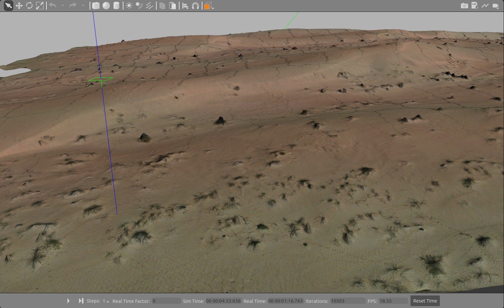

# Robot Path Planning using ROS

## Introduction
The goal is to simulate path planning of a four-wheeled robot in a 3D constructed model of desert keeping in view the robot should not ascend the elevation of more than 30 degrees.  
This repository describes the approaches used to solve this problem and the challenges being faced. So, husky - a well-known robot by clearpath robotics is used to simulate this whole scenario. First, the 3D desert model is loaded into the Gazebo simulation environment, and then husky is spawned on it. There were many challenges of simulating husky on the provided 3D model which are listed below in detail.  
All of this is developed and tested with Ubuntu18, ROS Melodic, and Gazebo9.

## Loading 3D Model in Gazebo
A 3D constructed model of the desert is provided to spawn the four-wheeled robot. Initially, the model was in .obj format which Gazebo does not support and has to be converted into a supported format. The model (.obj) is loaded into blender for the conversion. Pose and texture are alos corrected during the conversion process. After the correction, it is saved as .dae (Collada) format which is supported by Gazebo. Figure below shows the model in the blender before correction (left) and after correction (right). The converted model is loaded in Gazebo which can seen in below standalone figure. To load the 3D model in gazebo, run the following command (after cd to root directory of repository).
```
gazebo learn_ws/src/gazebo_world_class_18/worldsgazebo.world 
```


{ width=10% }

## Installing and Testing Husky
To install and simulate husky, run the following commands one by one.
```
sudo apt update
sudo apt upgrade
sudo apt-get install ros-melodic-husky-simulator
sudo apt-get install ros-melodic-husky-navigation ros-melodic-husky-gazebo ros-melodic-husky-viz
```
Set the environment variable
```
export HUSKY_GAZEBO_DESCRIPTION=$(rospack find husky_gazebo)/urdf/description.gazebo.xacro
```
In three separate terminals, run the following commands in the order listed below.
- Launch the Gazebo simulation environment
```
roslaunch husky_gazebo husky_playpen.launch
```
- Launch Rviz for visualization
```
roslaunch husky_viz view_robot.launch
```

- Launch the husky navigation node to navigate it
```
roslaunch husky_navigation move_base_mapless_demo.launch
```

Note: sometimes, husky does not run properly in ROS Melodic, if this happens then husky packages can be built from source by following the steps [here](https://answers.ros.org/question/256756/how-to-install-husky-simulator-in-kinetic/), but just clone the first repository as it contains all the packages of the second and third repositories as well.  
A glimps of how this works is shown below. To watch high resolution video follow the link [this](https://youtu.be/2wyo-RTvQVg) and [this](https://youtu.be/XJE7356JK8o).


## Challenges
Getting back to the original goal that is to navigate a four-wheeled robot on the provided desert environment. There were many challenges faced while doing this. The first challenge was that sometimes the desert environment does not load properly. It might be because of a bug in Gazebo9. The second challenge was faced when husky was spawned in the desert environment. Husky works fine with other worlds (like shown in the above section) but it stops publishing the transforms when both (desert and husky) are loaded at the same time. The figure below left shows the spawned husky on the desert world. It can be seen from the figure below that husky is giving error and not publishing anything which hindered its navigation. 


To reproduce this error, run the following commands (considering you are in the root directory of the repository).
```
cd learn_ws
catkin_make
source devel/setup.bash
roslaunch gazebo_world_class_18 robo.launch 
```


### Potential Solutions to the Challenges
The following things can be tried to solve the above-said problems
- Considering the problem with the 3D desert model: convert the .dae model into .dem (digital elevation map) using [this](http://gazebosim.org/tutorials/?tut=dem) and [this](https://gis.stackexchange.com/questions/110492/how-to-extract-dem-digital-elevation-model-from-3d-model) and then try loading the model and husky.
- Debug husky's model files
- Try a different robot instead of husky


## Possible Approaches to find the 30 deg Elevation
There can be multiple solutions to avoid 30-degree elevation in the path planning.
- One is to use the 3D lidar of the robot and do the segmentation of the point cloud to fit a plane in it. RANSAC (Random Sample Consensus) is a good algorithm to fit the plane. After fitting the plane, its angle can be found from the horizontal axis and if it is more than 30 degrees then consider it as an obstacle in the path planning to avoid it.
- Second approach can be to map the desired area using flying drones with 3D lidar mounted on them and save the whole map. This saved map can be processed and fed into path planning to avoid the 30-degree elevation. 

## Conclusion
The goal was to do path planning of a four-wheeled robot in a desert environment while avoiding the 30 degrees or more elevation. This goal is not fully achieved because of many challenges faced and limited time. But, everything is described including what are the challenges faced during this exercise and what could be the possible solutions to those challenges. 
